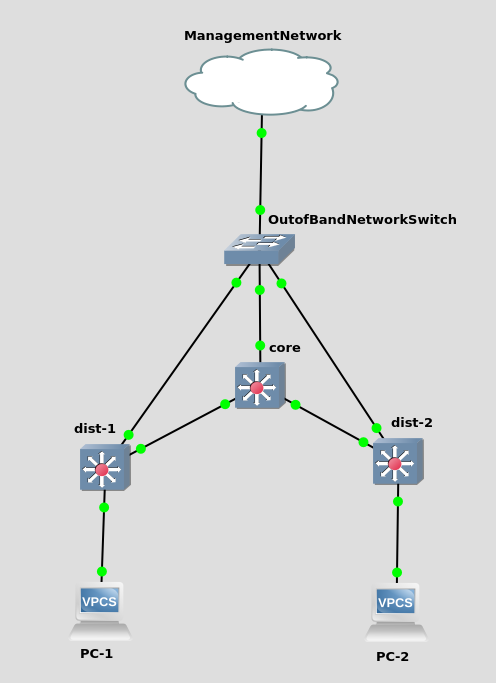

.. _getting-started:

Getting Started
===============

Installation
------------

To install Runcible via pip, run:

``pip3 install runcible``

.. note::
    Runcible is compatible with python 3.5 and higher

YAML File
---------

The easiest way to get started with Runcible is to write some definition files in YAML. This will allow you to become
familiar with all of Runcible's :ref:`modules` and try out some configurations. If you plan on managing a large
infrastructure, it is highly recommended to utilize Runcible with it's sister project, :ref:`mergedb`.

For example, to configure a single Cumulus switch, you could generate a yaml file like so:

.. literalinclude:: ../examples/yaml/cumulus_switch.yaml

To understand the contents of this file in depth, visit the :ref:`modules` section of the documentation.

To apply this configuration to the switch in question, simply run:

``runcible -y {path_to_yaml_file} '*.' apply``

You will get output that looks like:

.. code-block::

    The following changes will be applied:
    Device core:
    ==========================================
    bonds needs:
        bonds.po4.CREATE
        bonds.po4.mtu.SET: 9000
        bonds.po4.slaves.ADD: swp4
        bonds.po4.vlans.ADD: 20
        bonds.po4.vlans.ADD: 50
        bonds.po4.pvid.SET: 25
    interfaces needs:
        interfaces.swp1.vlans.ADD: 10
        interfaces.swp1.vlans.ADD: 20
        interfaces.swp1.vlans.ADD: 30
        interfaces.swp1.vlans.ADD: 40
        interfaces.swp1.vlans.ADD: 50
        interfaces.swp2.vlans.ADD: 10
        interfaces.swp2.vlans.ADD: 20
        interfaces.swp2.vlans.ADD: 30
        interfaces.swp2.vlans.ADD: 40
        interfaces.swp2.vlans.ADD: 50
        interfaces.swp3.vlans.ADD: 10
        interfaces.swp3.vlans.ADD: 20
        interfaces.swp3.vlans.ADD: 30
        interfaces.swp3.vlans.ADD: 40
        interfaces.swp3.vlans.ADD: 50
        interfaces.swp5.vlans.ADD: 10
        interfaces.swp5.vlans.ADD: 20
        interfaces.swp5.vlans.ADD: 30
        interfaces.swp5.vlans.ADD: 40
        interfaces.swp5.vlans.ADD: 50
    ntp_client needs no changes.
    system needs no changes.
    vlans needs:
        vlans.10.CREATE
        10.name.SET: vlan10
        vlans.20.CREATE
        20.name.SET: vlan20
        vlans.30.CREATE
        30.name.SET: vlan30
        vlans.40.CREATE
        40.name.SET: vlan40
        vlans.50.CREATE
        50.name.SET: vlan50
    Would you like to apply the changes? y/[n]y

Accepting these changes will apply them to the device.

.. code-block::

    Device core
    ==========================================
        bonds.po4.CREATE
        bonds.po4.slaves.ADD: swp4
        bonds.po4.mtu.SET: 9000
        bonds.po4.vlans.ADD: 20
        bonds.po4.vlans.ADD: 50
        bonds.po4.pvid.SET: 25
        interfaces.swp1.vlans.ADD: 10
        interfaces.swp1.vlans.ADD: 20
        interfaces.swp1.vlans.ADD: 30
        interfaces.swp1.vlans.ADD: 40
        interfaces.swp1.vlans.ADD: 50
        interfaces.swp2.vlans.ADD: 10
        interfaces.swp2.vlans.ADD: 20
        interfaces.swp2.vlans.ADD: 30
        interfaces.swp2.vlans.ADD: 40
        interfaces.swp2.vlans.ADD: 50
        interfaces.swp3.vlans.ADD: 10
        interfaces.swp3.vlans.ADD: 20
        interfaces.swp3.vlans.ADD: 30
        interfaces.swp3.vlans.ADD: 40
        interfaces.swp3.vlans.ADD: 50
        interfaces.swp5.vlans.ADD: 10
        interfaces.swp5.vlans.ADD: 20
        interfaces.swp5.vlans.ADD: 30
        interfaces.swp5.vlans.ADD: 40
        interfaces.swp5.vlans.ADD: 50
        vlans.10.CREATE
        10.name.SET: vlan10
        vlans.20.CREATE
        20.name.SET: vlan20
        vlans.30.CREATE
        30.name.SET: vlan30
        vlans.40.CREATE
        40.name.SET: vlan40
        vlans.50.CREATE
        50.name.SET: vlan50

MergeDB Datasource
------------------

.. _mergedb:

Setting Up MergeDB
^^^^^^^^^^^^^^^^^^

MergeDB is a project created for Runcible to make declaration of configurations easier, as a result MergeDB is a
preferred mechanism for defining Runcible declarations (although you can also use flat YAML or JSON files as well.)

For this example, I will build a simple 3 switch setup inside of GNS3 using Cumulus VX for the operating system.

Here is the topology:

.. warning::
    It is highly recommended to use Runcible with switch fabrics only when you have a dedicated out-of-band management
    network that won't become inaccessible in the event of misconfiguration.

First, create a directory that contains a file named ``mdb.yaml``, which we will leave blank for now. This file
indicates to MergeDB that we are creating a MergeDB database in this directory. Next we will create two folders,
one for our device declarations, and one for our configuration layers. We will call these folders ``devices`` and
``layers``. In the base of those two directories, create a file called ``dir.yaml`` in each directory and leave them
blank for now. These files inform MergeDB that the .yaml files we will create in these directories are valid MergeDB
declarations.

.. note::
    This directory structure is completely arbitrary. MergeDB is designed in a manner that lets you organize your
    declarations in whatever way makes sense to you.

Next, lets create a few configuration layers that define our switch configurations. Firstly, our switches all have the
default U: ``cumulus`` P: ``CumulusLinux!`` credentials, so lets create a layer that adds those attributes to the meta
object:

.. literalinclude:: ../examples/mergedb_getting_started/layers/ssh_auth.yaml

Next, our switches should all contain the same VLANS in this example, so lets make a layer that defines those:

.. literalinclude:: ../examples/mergedb_getting_started/layers/vlans.yaml

Note that we are using jinja2 templating to avoid needing to duplicate the vlan definitions.

Now, lets create some layers that define our switch environment. In this example, we want all of the uplinks from the
dist1 and dist2 switches to be tagged on all vlans, and the downlinks from the switches to the PCs to be untagged. As a
result, we will create two different layers called ``core.yaml`` and ``dist.yaml``.

.. literalinclude:: ../examples/mergedb_getting_started/layers/core.yaml

.. literalinclude:: ../examples/mergedb_getting_started/layers/dist.yaml

As you can see, our core has all tagged interfaces, whereas the first two ports on the dist switch are untagged, and the
last port is tagged.

Now we need to create the declarations for our switches. In the device directory, create a .yaml for each of the
devices:

.. literalinclude:: ../examples/mergedb_getting_started/switches/core.yaml

.. literalinclude:: ../examples/mergedb_getting_started/switches/dist1.yaml

.. literalinclude:: ../examples/mergedb_getting_started/switches/dist2.yaml

At this point, if you were to run MergeDB, you would get blank output because we haven't added anything to the build
list. So lets add the rest of our inheritance structure and the build list to the dir.yaml inside the devices directory:

.. literalinclude:: ../examples/mergedb_getting_started/switches/dir.yaml

Now, run mergedb and inspect the built configs.

.. command-output:: mergedb ../examples/mergedb_getting_started build
    :shell:
    :ellipsis: 20

You can also check the build process for each built declaration to see how MergeDB constructed it at each step.

.. command-output:: mergedb ../examples/mergedb_getting_started detail core.yaml
    :shell:
    :ellipsis: 40

Running Runcible from CLI
^^^^^^^^^^^^^^^^^^^^^^^^^

Now that we have a database constructed with some switch configuration, we can run Runcible to configure our test
environment.

.. code-block:: shell

    [mergedb_getting_started]$ runcible ".*" apply -m .
    The following changes will be applied:
    Device core:
    ==========================================
        WARNING: need 10.name.SET: vlan10 is not supported by provider <runcible.providers.cumulus.vlans.CumulusVlansProvider object at 0x7fe24e1258d0>
        WARNING: need 20.name.SET: vlan20 is not supported by provider <runcible.providers.cumulus.vlans.CumulusVlansProvider object at 0x7fe24e1258d0>
        WARNING: need 30.name.SET: vlan30 is not supported by provider <runcible.providers.cumulus.vlans.CumulusVlansProvider object at 0x7fe24e1258d0>
    vlans needs:
        vlans.10.CREATE
        vlans.20.CREATE
        vlans.30.CREATE
    interfaces needs:
        interfaces.swp1.vlans.ADD: 10
        interfaces.swp1.vlans.ADD: 20
        interfaces.swp1.vlans.ADD: 30
        interfaces.swp2.vlans.ADD: 10
        interfaces.swp2.vlans.ADD: 20
        interfaces.swp2.vlans.ADD: 30
        interfaces.swp3.vlans.ADD: 10
        interfaces.swp3.vlans.ADD: 20
        interfaces.swp3.vlans.ADD: 30
        interfaces.swp4.vlans.ADD: 10
        interfaces.swp4.vlans.ADD: 20
        interfaces.swp4.vlans.ADD: 30
        interfaces.swp5.vlans.ADD: 10
        interfaces.swp5.vlans.ADD: 20
        interfaces.swp5.vlans.ADD: 30
        interfaces.swp6.vlans.ADD: 10
        interfaces.swp6.vlans.ADD: 20
        interfaces.swp6.vlans.ADD: 30
    Device dist2:
    ==========================================
        WARNING: need 10.name.SET: vlan10 is not supported by provider <runcible.providers.cumulus.vlans.CumulusVlansProvider object at 0x7fe24e1259e8>
        WARNING: need 20.name.SET: vlan20 is not supported by provider <runcible.providers.cumulus.vlans.CumulusVlansProvider object at 0x7fe24e1259e8>
        WARNING: need 30.name.SET: vlan30 is not supported by provider <runcible.providers.cumulus.vlans.CumulusVlansProvider object at 0x7fe24e1259e8>
    vlans needs:
        vlans.10.CREATE
        vlans.20.CREATE
        vlans.30.CREATE
    interfaces needs:
        interfaces.swp1.pvid.SET: 10
        interfaces.swp2.pvid.SET: 10
        interfaces.swp6.vlans.ADD: 10
        interfaces.swp6.vlans.ADD: 20
        interfaces.swp6.vlans.ADD: 30
    Device dist1:
    ==========================================
        WARNING: need 10.name.SET: vlan10 is not supported by provider <runcible.providers.cumulus.vlans.CumulusVlansProvider object at 0x7fe24e125358>
        WARNING: need 20.name.SET: vlan20 is not supported by provider <runcible.providers.cumulus.vlans.CumulusVlansProvider object at 0x7fe24e125358>
        WARNING: need 30.name.SET: vlan30 is not supported by provider <runcible.providers.cumulus.vlans.CumulusVlansProvider object at 0x7fe24e125358>
    vlans needs:
        vlans.10.CREATE
        vlans.20.CREATE
        vlans.30.CREATE
    interfaces needs:
        interfaces.swp1.pvid.SET: 10
        interfaces.swp2.pvid.SET: 10
        interfaces.swp6.vlans.ADD: 10
        interfaces.swp6.vlans.ADD: 20
        interfaces.swp6.vlans.ADD: 30
    Would you like to apply the changes? y/[n]

Once you click yes, Runcible will apply all of the changes listed. By default, the naive scheduler will be used which
will run Runcible against the devices one after the other in the order specified.

.. code-block:: shell

    Device core
    ==========================================
        vlans.10.CREATE
        vlans.20.CREATE
        vlans.30.CREATE
        interfaces.swp1.vlans.ADD: 10
        interfaces.swp1.vlans.ADD: 20
        interfaces.swp1.vlans.ADD: 30
        interfaces.swp2.vlans.ADD: 10
        interfaces.swp2.vlans.ADD: 20
        interfaces.swp2.vlans.ADD: 30
        interfaces.swp3.vlans.ADD: 10
        interfaces.swp3.vlans.ADD: 20
        interfaces.swp3.vlans.ADD: 30
        interfaces.swp4.vlans.ADD: 10
        interfaces.swp4.vlans.ADD: 20
        interfaces.swp4.vlans.ADD: 30
        interfaces.swp5.vlans.ADD: 10
        interfaces.swp5.vlans.ADD: 20
        interfaces.swp5.vlans.ADD: 30
        interfaces.swp6.vlans.ADD: 10
        interfaces.swp6.vlans.ADD: 20
        interfaces.swp6.vlans.ADD: 30
    Device dist2
    ==========================================
        vlans.10.CREATE
        vlans.20.CREATE
        vlans.30.CREATE
        interfaces.swp1.pvid.SET: 10
        interfaces.swp2.pvid.SET: 10
        interfaces.swp6.vlans.ADD: 10
        interfaces.swp6.vlans.ADD: 20
        interfaces.swp6.vlans.ADD: 30
    Device dist1
    ==========================================
        vlans.10.CREATE
        vlans.20.CREATE
        vlans.30.CREATE
        interfaces.swp1.pvid.SET: 10
        interfaces.swp2.pvid.SET: 10
        interfaces.swp6.vlans.ADD: 10
        interfaces.swp6.vlans.ADD: 20
        interfaces.swp6.vlans.ADD: 30

